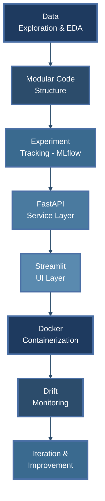
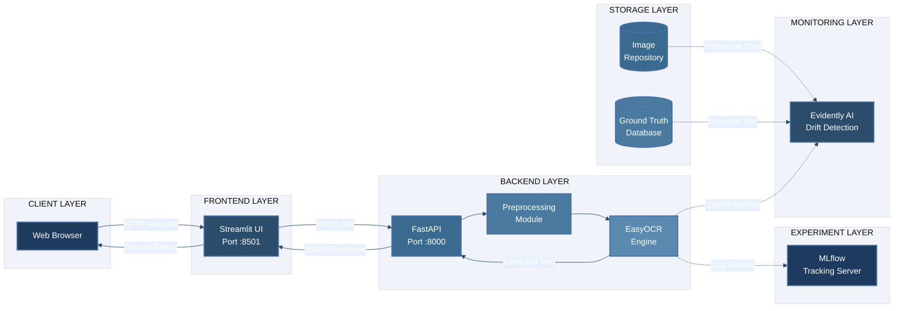

# 📄 DocScan MLOps | OCR System

____________________________________________________________________________________________________________

##  Why This Project Matters

- You don't need to train an OCR model from scratch.

- In 2026, the real skill is turning a pre‑trained OCR engine into a complete, dependable OCR system. 

- This project demonstrates exactly that,  engineering the **entire MLOps lifecycle** around a state‑of‑the‑art OCR model.

Instead of a throwaway notebook, you get:

- Experiment tracking with MLflow  

- Modular, reusable code  

- REST API for inference  

- Clean web UI for demos  

- Full Docker containerization  

- Drift monitoring for production readiness

____________________________________________________________________________________________________________

# 🔄 MLOps Lifecycle Covered

____________________________________________________________________________________________________________

# Tech Stack & Model

<table style="width:100%; border-collapse: collapse; font-family: -apple-system, BlinkMacSystemFont, 'Segoe UI', Roboto, sans-serif; box-shadow: 0 4px 8px rgba(0,0,0,0.1); border-radius: 12px; overflow: hidden;">
  <thead>
    <tr style="background: linear-gradient(135deg, #1e3a5f 0%, #2c4c6b 100%); color: white;">
      <th style="padding: 16px 20px; text-align: left; font-size: 16px; font-weight: 600; border-right: 1px solid #3a6a8f;">Category</th>
      <th style="padding: 16px 20px; text-align: left; font-size: 16px; font-weight: 600; border-right: 1px solid #3a6a8f;">Technology</th>
      <th style="padding: 16px 20px; text-align: left; font-size: 16px; font-weight: 600;">Purpose</th>
    </tr>
  </thead>
  <tbody>
    <tr style="background-color: #f8fafc; border-bottom: 1px solid #e2e8f0;">
      <td style="padding: 14px 20px; font-weight: 600; color: #1e3a5f; border-right: 1px solid #e2e8f0;">OCR Engine</td>
      <td style="padding: 14px 20px; border-right: 1px solid #e2e8f0;"><a href="https://github.com/JaidedAI/EasyOCR" style="color: #2563eb; text-decoration: none; font-weight: 500;">EasyOCR</a></td>
      <td style="padding: 14px 20px; color: #334155;">Pre-trained multi-language text extraction</td>
    </tr>
    <tr style="background-color: #ffffff; border-bottom: 1px solid #e2e8f0;">
      <td style="padding: 14px 20px; font-weight: 600; color: #1e3a5f; border-right: 1px solid #e2e8f0;">Backend API</td>
      <td style="padding: 14px 20px; border-right: 1px solid #e2e8f0;">FastAPI + Uvicorn</td>
      <td style="padding: 14px 20px; color: #334155;">REST endpoint for OCR inference</td>
    </tr>
    <tr style="background-color: #f8fafc; border-bottom: 1px solid #e2e8f0;">
      <td style="padding: 14px 20px; font-weight: 600; color: #1e3a5f; border-right: 1px solid #e2e8f0;">Frontend</td>
      <td style="padding: 14px 20px; border-right: 1px solid #e2e8f0;">Streamlit</td>
      <td style="padding: 14px 20px; color: #334155;">Interactive UI for testing and demos</td>
    </tr>
    <tr style="background-color: #ffffff; border-bottom: 1px solid #e2e8f0;">
      <td style="padding: 14px 20px; font-weight: 600; color: #1e3a5f; border-right: 1px solid #e2e8f0;">Experiment Tracking</td>
      <td style="padding: 14px 20px; border-right: 1px solid #e2e8f0;">MLflow</td>
      <td style="padding: 14px 20px; color: #334155;">Log parameters, metrics, and artifacts</td>
    </tr>
    <tr style="background-color: #f8fafc; border-bottom: 1px solid #e2e8f0;">
      <td style="padding: 14px 20px; font-weight: 600; color: #1e3a5f; border-right: 1px solid #e2e8f0;">Drift Monitoring</td>
      <td style="padding: 14px 20px; border-right: 1px solid #e2e8f0;">Evidently AI</td>
      <td style="padding: 14px 20px; color: #334155;">Detect image quality degradation</td>
    </tr>
    <tr style="background-color: #ffffff; border-bottom: 1px solid #e2e8f0;">
      <td style="padding: 14px 20px; font-weight: 600; color: #1e3a5f; border-right: 1px solid #e2e8f0;">Containerization</td>
      <td style="padding: 14px 20px; border-right: 1px solid #e2e8f0;">Docker + Docker Compose</td>
      <td style="padding: 14px 20px; color: #334155;">Multi-service orchestration</td>
    </tr>
    <tr style="background-color: #f8fafc; border-bottom: 1px solid #e2e8f0;">
      <td style="padding: 14px 20px; font-weight: 600; color: #1e3a5f; border-right: 1px solid #e2e8f0;">Image Processing</td>
      <td style="padding: 14px 20px; border-right: 1px solid #e2e8f0;">OpenCV, Pillow</td>
      <td style="padding: 14px 20px; color: #334155;">Preprocessing (grayscale, threshold, denoise)</td>
    </tr>
    <tr style="background-color: #ffffff;">
      <td style="padding: 14px 20px; font-weight: 600; color: #1e3a5f; border-right: 1px solid #e2e8f0;">Metrics</td>
      <td style="padding: 14px 20px; border-right: 1px solid #e2e8f0;">Levenshtein</td>
      <td style="padding: 14px 20px; color: #334155;">Character Error Rate (CER) calculation</td>
    </tr>
  </tbody>
</table>

____________________________________________________________________________________________________________

# System Architecture

____________________________________________________________________________________________________________

#  Running the Project Locally

<table style="width:100%; border-collapse: collapse; font-family: -apple-system, BlinkMacSystemFont, 'Segoe UI', Roboto, sans-serif; box-shadow: 0 4px 8px rgba(0,0,0,0.1); border-radius: 12px; overflow: hidden; margin-bottom: 30px;">
  <thead>
    <tr style="background: linear-gradient(135deg, #1e3a5f 0%, #2c4c6b 100%); color: white;">
      <th style="padding: 16px 20px; text-align: left; font-size: 16px; font-weight: 600; width: 15%;">Step</th>
      <th style="padding: 16px 20px; text-align: left; font-size: 16px; font-weight: 600; width: 85%;">Instructions</th>
    </tr>
  </thead>
  <tbody>
    <tr style="background-color: #f8fafc; border-bottom: 1px solid #e2e8f0;">
      <td style="padding: 16px 20px; font-weight: 700; color: #1e3a5f; vertical-align: top; border-right: 1px solid #e2e8f0;">1. Clone & Setup</td>
      <td style="padding: 16px 20px; color: #334155;">
        <code style="background-color: #1e2b3c; color: #e2e8f0; padding: 12px 16px; border-radius: 8px; display: block; font-family: 'Courier New', monospace; font-size: 14px;">
          git clone https://github.com/UzairRan/easyocr-mlops.git 
          cd easyocr-mlops  
          python -m venv venv 
          source venv/bin/activate &nbsp;&nbsp;&nbsp;# Windows: venv\Scripts\activate 
          pip install -r docker/requirements.txt
        </code>
      </td>
    </tr>
    <tr style="background-color: #ffffff; border-bottom: 1px solid #e2e8f0;">
      <td style="padding: 16px 20px; font-weight: 700; color: #1e3a5f; vertical-align: top; border-right: 1px solid #e2e8f0;">2. Prepare Data</td>
      <td style="padding: 16px 20px; color: #334155;">
        Place document images in <code style="background-color: #f1f5f9; padding: 2px 8px; border-radius: 4px;">data/raw/</code> and corresponding ground truth <code style="background-color: #f1f5f9; padding: 2px 8px; border-radius: 4px;">.txt</code> files in <code style="background-color: #f1f5f9; padding: 2px 8px; border-radius: 4px;">data/ground_truth/</code> (same filename, different extension).
      </td>
    </tr>
    <tr style="background-color: #f8fafc; border-bottom: 1px solid #e2e8f0;">
      <td style="padding: 16px 20px; font-weight: 700; color: #1e3a5f; vertical-align: top; border-right: 1px solid #e2e8f0;">3. MLflow Experiments</td>
      <td style="padding: 16px 20px; color: #334155;">
        <code style="background-color: #1e2b3c; color: #e2e8f0; padding: 12px 16px; border-radius: 8px; display: block; font-family: 'Courier New', monospace; font-size: 14px; margin-bottom: 10px;">
          python run_experiment.py --preprocess none 
          python run_experiment.py --preprocess grayscale 
          mlflow ui --backend-store-uri sqlite:///mlflow.db
        </code>
        Visit <code style="background-color: #f1f5f9; padding: 2px 8px; border-radius: 4px;">http://localhost:5000</code> to compare runs.
      </td>
    </tr>
    <tr style="background-color: #ffffff; border-bottom: 1px solid #e2e8f0;">
      <td style="padding: 16px 20px; font-weight: 700; color: #1e3a5f; vertical-align: top; border-right: 1px solid #e2e8f0;">4. Start FastAPI</td>
      <td style="padding: 16px 20px; color: #334155;">
        <code style="background-color: #1e2b3c; color: #e2e8f0; padding: 12px 16px; border-radius: 8px; display: block; font-family: 'Courier New', monospace; font-size: 14px; margin-bottom: 10px;">
          uvicorn app.main:app --reload --host 0.0.0.0 --port 8000
        </code>
        Test the API interactively at <code style="background-color: #f1f5f9; padding: 2px 8px; border-radius: 4px;">http://localhost:8000/docs</code>.
      </td>
    </tr>
    <tr style="background-color: #f8fafc; border-bottom: 1px solid #e2e8f0;">
      <td style="padding: 16px 20px; font-weight: 700; color: #1e3a5f; vertical-align: top; border-right: 1px solid #e2e8f0;">5. Start Streamlit UI</td>
      <td style="padding: 16px 20px; color: #334155;">
        <code style="background-color: #1e2b3c; color: #e2e8f0; padding: 12px 16px; border-radius: 8px; display: block; font-family: 'Courier New', monospace; font-size: 14px; margin-bottom: 10px;">
          streamlit run ui/streamlit_app.py
        </code>
        Open <code style="background-color: #f1f5f9; padding: 2px 8px; border-radius: 4px;">http://localhost:8501</code> to use the OCR interface.
      </td>
    </tr>
    <tr style="background-color: #ffffff; border-bottom: 1px solid #e2e8f0;">
      <td style="padding: 16px 20px; font-weight: 700; color: #1e3a5f; vertical-align: top; border-right: 1px solid #e2e8f0;">6. Drift Monitoring</td>
      <td style="padding: 16px 20px; color: #334155;">
        <code style="background-color: #1e2b3c; color: #e2e8f0; padding: 12px 16px; border-radius: 8px; display: block; font-family: 'Courier New', monospace; font-size: 14px; margin-bottom: 10px;">
          python monitor_drift.py
        </code>
        Open <code style="background-color: #f1f5f9; padding: 2px 8px; border-radius: 4px;">drift_report.html</code> to view image quality analysis.
      </td>
    </tr>
    <tr style="background-color: #f8fafc;">
      <td style="padding: 16px 20px; font-weight: 700; color: #1e3a5f; vertical-align: top; border-right: 1px solid #e2e8f0;">7. Docker Deployment</td>
      <td style="padding: 16px 20px; color: #334155;">
        <code style="background-color: #1e2b3c; color: #e2e8f0; padding: 12px 16px; border-radius: 8px; display: block; font-family: 'Courier New', monospace; font-size: 14px; margin-bottom: 10px;">
          cd docker 
          docker-compose up --build
        </code>
        Access UI at <code style="background-color: #f1f5f9; padding: 2px 8px; border-radius: 4px;">http://localhost:8501</code>. Both API and UI run in isolated containers.
      </td>
    </tr>
  </tbody>
</table>

____________________________________________________________________________________________________________

#  Key Commands Summary

<table style="width:100%; border-collapse: collapse; font-family: -apple-system, BlinkMacSystemFont, 'Segoe UI', Roboto, sans-serif; box-shadow: 0 4px 8px rgba(0,0,0,0.1); border-radius: 12px; overflow: hidden;">
  <thead>
    <tr style="background: linear-gradient(135deg, #1e3a5f 0%, #2c4c6b 100%); color: white;">
      <th style="padding: 16px 20px; text-align: left; font-size: 16px; font-weight: 600; width: 45%; border-right: 1px solid #3a6a8f;">Task</th>
      <th style="padding: 16px 20px; text-align: left; font-size: 16px; font-weight: 600; width: 55%;">Command</th>
    </tr>
  </thead>
  <tbody>
    <tr style="background-color: #f8fafc; border-bottom: 1px solid #e2e8f0;">
      <td style="padding: 14px 20px; font-weight: 600; color: #1e3a5f; border-right: 1px solid #e2e8f0;">Run MLflow Experiment</td>
      <td style="padding: 14px 20px; color: #334155;">
        <code style="background-color: #1e2b3c; color: #e2e8f0; padding: 6px 12px; border-radius: 6px; font-family: 'Courier New', monospace;">python run_experiment.py --preprocess &lt;method&gt;</code>
      </td>
    </tr>
    <tr style="background-color: #ffffff; border-bottom: 1px solid #e2e8f0;">
      <td style="padding: 14px 20px; font-weight: 600; color: #1e3a5f; border-right: 1px solid #e2e8f0;">View MLflow UI</td>
      <td style="padding: 14px 20px; color: #334155;">
        <code style="background-color: #1e2b3c; color: #e2e8f0; padding: 6px 12px; border-radius: 6px; font-family: 'Courier New', monospace;">mlflow ui --backend-store-uri sqlite:///mlflow.db</code>
      </td>
    </tr>
    <tr style="background-color: #f8fafc; border-bottom: 1px solid #e2e8f0;">
      <td style="padding: 14px 20px; font-weight: 600; color: #1e3a5f; border-right: 1px solid #e2e8f0;">Start FastAPI</td>
      <td style="padding: 14px 20px; color: #334155;">
        <code style="background-color: #1e2b3c; color: #e2e8f0; padding: 6px 12px; border-radius: 6px; font-family: 'Courier New', monospace;">uvicorn app.main:app --reload --port 8000</code>
      </td>
    </tr>
    <tr style="background-color: #ffffff; border-bottom: 1px solid #e2e8f0;">
      <td style="padding: 14px 20px; font-weight: 600; color: #1e3a5f; border-right: 1px solid #e2e8f0;">Start Streamlit</td>
      <td style="padding: 14px 20px; color: #334155;">
        <code style="background-color: #1e2b3c; color: #e2e8f0; padding: 6px 12px; border-radius: 6px; font-family: 'Courier New', monospace;">streamlit run ui/streamlit_app.py</code>
      </td>
    </tr>
    <tr style="background-color: #f8fafc; border-bottom: 1px solid #e2e8f0;">
      <td style="padding: 14px 20px; font-weight: 600; color: #1e3a5f; border-right: 1px solid #e2e8f0;">Run Drift Monitor</td>
      <td style="padding: 14px 20px; color: #334155;">
        <code style="background-color: #1e2b3c; color: #e2e8f0; padding: 6px 12px; border-radius: 6px; font-family: 'Courier New', monospace;">python monitor_drift.py</code>
      </td>
    </tr>
    <tr style="background-color: #ffffff; border-bottom: 1px solid #e2e8f0;">
      <td style="padding: 14px 20px; font-weight: 600; color: #1e3a5f; border-right: 1px solid #e2e8f0;">Build Docker Images</td>
      <td style="padding: 14px 20px; color: #334155;">
        <code style="background-color: #1e2b3c; color: #e2e8f0; padding: 6px 12px; border-radius: 6px; font-family: 'Courier New', monospace;">cd docker && docker-compose up --build</code>
      </td>
    </tr>
    <tr style="background-color: #f8fafc;">
      <td style="padding: 14px 20px; font-weight: 600; color: #1e3a5f; border-right: 1px solid #e2e8f0;">Clean Docker Resources</td>
      <td style="padding: 14px 20px; color: #334155;">
        <code style="background-color: #1e2b3c; color: #e2e8f0; padding: 6px 12px; border-radius: 6px; font-family: 'Courier New', monospace;">docker system prune -a</code>
      </td>
    </tr>
  </tbody>
</table>

____________________________________________________________________________________________________________
____________________________________________________________________________________________________________

